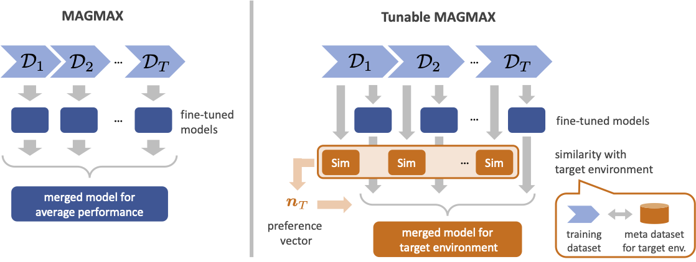

# Tunable MAGMAX: Preference-Aware Model Merging for Continual Learning ([arXiv](https://arxiv.org/abs/2605.20803))

This is the official repository for the paper:

> **Tunable MAGMAX: Preference-Aware Model Merging for Continual Learning**<br>
> Kei Hiroshima, Kento Uchida, Shinichi Shirakawa, Yokohama National University<br>
> International Conference on Pattern Recognition 2026

<p align="center">

</p>

> **Abstract:** Continual learning (CL) aims to train models sequentially on multiple tasks while mitigating catastrophic forgetting of previously learned knowledge. Recent advances in large pre-trained models (LPMs) and model merging techniques, such as MAGMAX, have demonstrated effective CL performance by combining task-specific parameters. However, existing methods primarily focus on average performance across all tasks and do not adequately address how to construct models accommodating different deployment environments or varying user preferences. This paper proposes a model merging framework, termed Tunable MAGMAX, which enables preference-aware control of task-specific performance in CL. Our method introduces a preference vector that controls the number of elements selected from each task vector during model merging, allowing us to adjust the merged model performance according to their deployment needs. We further propose a method for automatically constructing appropriate preference vectors by leveraging small amounts of target environment data and datasets from model training tasks, thereby eliminating the need for manual specification. The experimental result on CL benchmark tasks demonstrates that Tunable MAGMAX effectively controls task-wise performance and successfully adapts merged models to various target environments. The proposed Tunable MAGMAX achieves superior or comparable performance to baseline methods, making it a practical solution for deploying CL models to various environments where the preferences of each task performance differ.


## Installation

For a quick installation use the following commands:
```bash
conda env create
conda activate magmax
```

If it does not work, the env was created by the following commands:
```bash
conda create --name magmax python=3.10
conda activate magmax
```


## Usage

The code is separated into two parts:
* training — `finetune_splitted.py` via `scripts/finetune.sh`
* merging — `merge_for_targetdata.py` via `scripts/merge.sh`

A combined script that runs both steps sequentially is also provided as `scripts/finetune_merge.sh`.

### Step 0: Configure paths

Set the two directory paths in `src/config.py` before running any scripts:

- `BASE_DIR` — root directory where model checkpoints will be saved
- `DATA_DIR` — root directory containing the datasets

Alternatively, you can set environment variables instead of editing the file:
```bash
export MAGMAX_BASE_DIR=/path/to/checkpoints
export MAGMAX_DATA_DIR=/path/to/data
```

### Step 1: Fine-tuning

Edit the parameters in `scripts/finetune.sh` (model, dataset, n\_splits, task\_seq, seed, etc.) and run:
```bash
bash scripts/finetune.sh
```

### Step 2: Merging with target data

Edit the parameters in `scripts/merge.sh` (including `merge_fn` and `similarity_metric`) and run:
```bash
bash scripts/merge.sh
```

The key parameter `merge_fn` selects the merging strategy:
- `masked_magmax_with_targetdata` — Tunable MAGMAX (proposed)
- `magmax`, `ties`, `average`, `random_mix`, `select_one_task_vector` — baselines

When using `masked_magmax_with_targetdata`, the `similarity_metric` parameter controls how the preference vector is constructed:
- `labels` — label-based similarity
- `ot_embedded`, `cosine_embedded`, `mmd_embedded` — embedded feature-based metrics

### Combined run

To run fine-tuning and merging in a single script:
```bash
bash scripts/finetune_merge.sh
```

### Tips

Use `CUDA_VISIBLE_DEVICES=X` to restrict GPU usage to a specific device (set via `gpu_id` in the scripts).


## Third-Party Code

### MAGMAX
Source: https://github.com/danielm1405/magmax<br>
Paper: Marczak, D., Twardowski, B., Trzciński, T., & Cygert, S. (2024).<br>
[MagMax: Leveraging Model Merging for Seamless Continual Learning](http://arxiv.org/abs/2407.06322). ECCV2024<br>
License: No license (as of 2026-05-20). Used with the intent to comply with any future license.<br>
Files: src/modeling.py, src/heads.py, src/merging/task_vector.py, src/merging/ties.py,
       src/datasets/imagenetr.py, src/datasets/registry.py, src/args.py,
       src/utils.py, src/trainer.py, src/eval.py, src/datasets/common.py, src/datasets/cifar100.py
Modified files: `finetune_spilitted.py, merge_for_targetdata.py, and files in src/`

### perceptionCLIP
Source: https://github.com/umd-huang-lab/perceptionCLIP<br>
Paper: An, B., Zhu, S., Panaitescu-Liess, M.-A., Mummadi, C. K., & Huang, F. (2024).<br>
[PerceptionCLIP: Visual Classification by Inferring and Conditioning on Contexts](https://arxiv.org/abs/2308.01313). ICLR 2024<br>
License: MIT License (Copyright (c) 2023 CMU Locus Lab)<br>
Files: `src/datasets/templates.py (partial)`

### TIES-Merging
Source: https://github.com/prateeky2806/ties-merging<br>
Paper: Yadav, P., Tam, D., Choshen, L., Raffel, C., & Bansal, M. (2023).<br>
[TIES-Merging: Resolving Interference When Merging Models](http://arxiv.org/abs/2306.01708). NeurIPS 2023<br>
License: BSD 3-Clause License (Copyright (c) 2022 Salesforce, Inc.)<br>
Files: `src/merging/ties.py`


## Citation
If you find this work useful, please consider citing it:
```bibtex
@inproceedings{hiroshima2026tunablemagmax,
    title     = {Tunable {MAGMAX}: Preference-Aware Model Merging for Continual Learning},
    author    = {Kei Hiroshima and Kento Uchida and Shinichi Shirakawa},
    booktitle = {International Conference on Pattern Recognition}
    year      = {2026}
}
```
