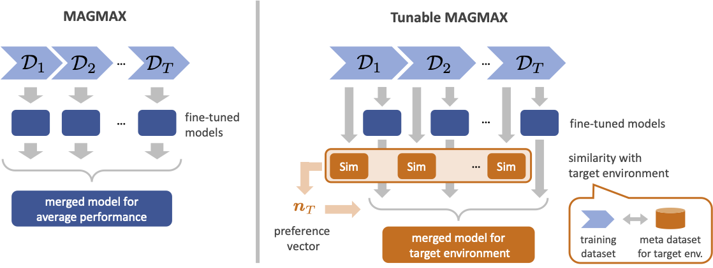

# Tunable MAGMAX: Preference-Aware Model Merging for Continual Learning ([arXiv](https://arxiv.org/abs/2605.20803))

This is the official repository for the paper:

> **Tunable MAGMAX: Preference-Aware Model Merging for Continual Learning**<br>
> Kei Hiroshima, Kento Uchida, Shinichi Shirakawa, Yokohama National University<br>
> International Conference on Pattern Recognition 2026

<p align="center">

</p>

> **Abstract:** Continual learning (CL) aims to train models sequentially on multiple tasks while mitigating catastrophic forgetting of previously learned knowledge. Recent advances in large pre-trained models (LPMs) and model merging techniques, such as MAGMAX, have demonstrated effective CL performance by combining task-specific parameters. However, existing methods primarily focus on average performance across all tasks and do not adequately address how to construct models accommodating different deployment environments or varying user preferences. This paper proposes a model merging framework, termed Tunable MAGMAX, which enables preference-aware control of task-specific performance in CL. Our method introduces a preference vector that controls the number of elements selected from each task vector during model merging, allowing us to adjust the merged model performance according to their deployment needs. We further propose a method for automatically constructing appropriate preference vectors by leveraging small amounts of target environment data and datasets from model training tasks, thereby eliminating the need for manual specification. The experimental result on CL benchmark tasks demonstrates that Tunable MAGMAX effectively controls task-wise performance and successfully adapts merged models to various target environments. The proposed Tunable MAGMAX achieves superior or comparable performance to baseline methods, making it a practical solution for deploying CL models to various environments where the preferences of each task performance differ.


## Installation

Install with [uv](https://docs.astral.sh/uv/):
```bash
uv sync
```
This installs PyTorch from the CUDA 12.8 wheel index configured in `pyproject.toml` (`[tool.uv.sources]` / `[[tool.uv.index]]`). If your GPU/driver needs a different CUDA version, edit that index URL before running `uv sync`. All commands below are run as `uv run python ...` instead of `python ...`.

The vision pipeline (CIFAR100/ImageNetR) also works under conda instead:
```bash
conda env create
conda activate magmax
```
If that does not work, the env was created by the following commands:
```bash
conda create --name magmax python=3.10
conda activate magmax
```


## Usage

Two entry points, both thin: they parse arguments and dispatch on `--dataset` to
a backend that implements `finetune(args)` / `merge_and_evaluate(args)`
(`src/backends/registry.py`).

* `finetune_splitted.py` — trains one model per task, saving a checkpoint each
* `merge_for_targetdata.py` — merges those checkpoints and evaluates the result

| `--dataset` | Backend | Backbone |
|---|---|---|
| `CIFAR100`, `ImageNetR` | `vision_backend.py` | CLIP ViT |
| `StdCL`, `LSB` | `nlp_classification_backend.py` | T5 (text-to-text, O-LoRA's setting) |
| `CITB19`, `CITB38` | `nlp_seq2seq_backend.py` | BERT2BERT |

### Implementation flow

**Vision (`vision_backend.py`)**
1. `finetune(args)` → `_run_sequential_finetuning`: fine-tunes a CLIP ViT
   class-incrementally, one `finetuned_{i}.pt` checkpoint per split.
2. `merge_and_evaluate(args)` → `src/eval.py::evaluate_merged_fts_on_target_data`,
   the one loop every `--merge_fn` goes through: for each target environment in
   `--target_config`, builds the mixed test set (`src/datasets/common.py::construct_target_dataset`,
   which also carves off a 10% meta split) and merges according to
   `MergeSpec.needs_target_data` (`src/merging/registry.py`) — baselines merge
   once via `apply_merge`; `masked_magmax_with_targetdata` estimates a
   preference vector from the meta split (`src/merging/similarity.py`,
   `--similarity_metric`) and merges via `mask_and_merge_by_weights`
   (`src/merging/task_vectors.py`).

**NLP classification (`nlp_classification_backend.py`, `StdCL`/`LSB`)**
1. `finetune(args)` → `src/nlp/finetune_nlp.py::finetune_task_sequence`: the
   same fine-tuning loop as vision (skip-if-exists, chain from the previous
   task under `--sequential-finetuning`), driving T5 as a text-to-text model
   (every task generates its label string, so there is no per-task head).
   `--finetune_mode full` saves a `finetuned_{i}.pt` per task;
   `--finetune_mode lora` saves only a LoRA `adapter_{i}.pt` per task
   (`src/nlp/lora.py`), and each task starts from the zero-shot model with
   every earlier adapter merged in.
2. `merge_and_evaluate(args)` mirrors vision's `evaluate_merged_fts_on_target_data`
   step for step — same `--target_config` loop, same `MergeSpec.needs_target_data`
   branch, every `--merge_fn` scored against every target environment — but
   needs no meta split or similarity estimate: the tasks are already
   separate datasets, so `masked_magmax_with_targetdata`'s preference vector
   *is* the target environment's own known mixing ratio
   (`src/nlp/target_data.py::build_target_weights`). Under LoRA the task
   vectors are rebuilt from the adapters. Scoring is exact match on the
   generated label.

**NLP seq2seq (`nlp_seq2seq_backend.py`, `CITB19`/`CITB38`)**
Same fine-tuning loop, but `merge_and_evaluate` supports the baselines only
(a plain `merge_task_vectors` call) and reports generation loss per task —
no target-environment loop, no proposed method.

### Step 0: Configure paths

```bash
export MAGMAX_BASE_DIR=/path/to/checkpoints   # where checkpoints are written
export MAGMAX_DATA_DIR=/path/to/data          # where the vision datasets live
```

Or edit the defaults in `src/config.py`. `MAGMAX_DATA_DIR` is unused by the NLP
backends, which stream from the Hugging Face Hub (cached under `HF_HOME`).

### Step 1: Fine-tuning

```bash
bash scripts/vision/finetune.sh          # edit the variables at the top first
# every n_splits x seed (5/20/50 x 3/4/5) for one dataset; resumable, continues past failures:
dataset=CIFAR100 bash scripts/vision/finetune_all.sh
```

Or directly:

```bash
uv run python finetune_splitted.py \
    --model ViT-B-16 --dataset CIFAR100 --n_splits 5 \
    --split_strategy class --sequential-finetuning \
    --epochs 10 --seed 3 --taskseq_pattern A --batch_size 32
```

Checkpoints land in
`$MAGMAX_BASE_DIR/checkpoints/{model}/[sequential_finetuning/]{group}/{scope}/ft-pattern_{p}-epochs-{e}-seed:{s}/finetuned_{i}.pt`.
A run that is interrupted can be resumed by re-issuing the same command:
checkpoints that already exist are skipped, and the next task still continues
from the one before it.

> **The `scripts/**/*.sh` wrappers call `uv run python`**, so run them with plain
> `bash scripts/...` from the repository root; no environment needs activating.
> Under conda, replace `uv run python` with `python` in the script.
> The fine-tuning scripts pass `--wandb_entity_name` (set at the top of each
> script); set `WANDB_MODE=offline` or `disabled` to run without a W&B account.

### Step 2: Merging and evaluation

```bash
bash scripts/vision/merge.sh
```

Every variable at the top of `merge.sh` can be overridden from the environment
(`merge_fn=magmax n_splits=20 bash scripts/vision/merge.sh`). To run every
method for one fine-tuned run — each baseline once, the proposed method once per
similarity metric — use `merge_comparison.sh`, which takes the same overrides plus
`merge_fns` / `similarity_metrics` lists:

```bash
dataset=CIFAR100 n_splits=20 seed=3 bash scripts/vision/merge_comparison.sh
# every n_splits x seed (5/20/50 x 3/4/5), after finetune_all.sh:
dataset=CIFAR100 bash scripts/vision/merge_comparison_all.sh
# Fig. 4 (number of tasks in the target environment):
n_splits=20 target_config=target_data_config_split20 \
    merge_fns="magmax masked_magmax_with_targetdata" similarity_metrics="labels ot_embedded" \
    bash scripts/vision/merge_comparison.sh
```

A failing method does not stop the sweep; failures are listed at the end.
Each method's stdout goes to
`outs/{model}/sequential_finetuning/class_incremental/{dir_name}/{dataset}-{n_splits}/taskseq_{p}/merge-{merge_fn}[-{similarity_metric}]-{target_config}-seed:{s}.out`.

Or directly:

```bash
uv run python merge_for_targetdata.py \
    --model ViT-B-16 --dataset CIFAR100 --n_splits 5 \
    --split_strategy class --sequential-finetuning \
    --epochs 10 --seed 3 --taskseq_pattern A --batch_size 32 \
    --merge_fn masked_magmax_with_targetdata --similarity_metric labels \
    --num_train_data_each_task 500 --num_target_data 1000 \
    --target_config target_data_config --results_db logs/my-run
```

`--merge_fn` selects the strategy; they are all defined in one place,
`src/merging/registry.py`:

| `--merge_fn` | Method | NLP support |
|---|---|---|
| `masked_magmax_with_targetdata` | **Tunable MAGMAX (proposed)** | `StdCL`/`LSB` only |
| `magmax` | MAGMAX | yes |
| `ties` | TIES-Merging | yes |
| `average` | Model Soup | yes |
| `random_mix` | Rand Mix | yes |
| `finetune` | Baseline: keep the last task's model, no merging | yes |

`--similarity_metric` applies to vision's `masked_magmax_with_targetdata` only
(NLP's preference vector needs no estimate — see "NLP tasks" below) and picks
how the preference vector is estimated: `labels` (label-distribution
similarity), or `ot_embedded` / `cosine_embedded` / `mmd_embedded` (feature-space
distances). The raw `cosine` / `mmd` / `ot` variants skip the encoder and
compare pixels directly.

### Target environments

A target environment is a mixture of some of the trained tasks, in some ratio.
`--target_config NAME` reads `configs/NAME.json`:

```json
{"dataset_configs": [
  {"num_task_to_be_fetched": 2,          // -1 means every task
   "ratio_task_to_be_fetched": [0.8, 0.2], // [-1] means an even split
   "variants": [{"target_id": 1, "random_seed": 42}]}
]}
```

Each entry describes one *kind* of environment; its `variants` are independent
draws of that kind, each identified by `target_id` and sampled with its own
`random_seed`. Shipped configs:

| Config | Contents |
|---|---|
| `target_data_config` | 26 environments: 5 mixing ratios x 5 seeds, plus one all-tasks entry |
| `target_data_config_lsb` | the same shape, for StdCL and LSB (2-task, 3-task and all-task mixtures fit both) |
| `target_data_config_split{5,20,50}` | sweeps over how many tasks a mixture draws from; sized per `--n_splits` |
| `target_data_config_smoke` | 3 environments, for a quick end-to-end check |

`--num_target_data` sets how many examples an environment holds (the
`split{N}` configs carry their own sizes and override it).

**Vision only** additionally holds out 10% of each task's draw as a meta
dataset, which `masked_magmax_with_targetdata` uses to estimate the
preference vector (`src/datasets/common.py::construct_target_dataset`);
baselines build it too but ignore it. **NLP needs no meta split** — see
"NLP tasks" below.

### Where results go

**Vision** writes one JSON per target environment under `--results_db`, for
every `--merge_fn`:

```
${results_db}/{merge_fn}/[{similarity_metric}/]{merge_fn}_lambda0.5_[{metric}_]target{id}_seed{s}.json
```

Every method's file holds `overall_accuracy` (micro-averaged over examples),
`average_accuracy` (mean over tasks), `taskwise_accuracies`, and a
`target_dataset_info` block with the target environment's composition
(`target_id`, `ratio_task_to_be_fetched`, `task_idx_selected`,
`num_data_each_task`, ...). Only `masked_magmax_with_targetdata`'s file also
holds `similarity_metric`, `weights_each_task` (the preference vector), and
`num_unaligned` / `num_params_all`.

**NLP ignores `--results_db`** and writes into the checkpoint directory instead,
one JSON per target environment for every `--merge_fn` (baselines included —
see below):

```
.../nlp_classification/{dataset}[-lora]/ft-pattern_{p}-epochs-{e}-seed:{s}/{merge_fn}/target{id}_seed{s}.json
```

Every method's file holds `overall_accuracy`, `taskwise_accuracies`,
`ratio_task_to_be_fetched`, `task_idx_selected`, and `num_data_each_task` at
the top level — a flatter shape than vision's, with no `average_accuracy` or
nested `target_dataset_info`. Only `masked_magmax_with_targetdata`'s file also
holds `weights_each_task` (the preference vector) and `num_unaligned` /
`num_params_all`.

With `--eval_full_testsets`, every method that yields a single model (all
but `masked_magmax_with_targetdata`) is also scored on every task's whole
test split, and `{merge_fn}/full_testsets_seed{s}.json` holds its
`taskwise_accuracies` and `average_accuracy` — O-LoRA's Average Accuracy.

### Combined run

```bash
bash scripts/vision/finetune_merge.sh
```

### Key arguments

| Flag | Default | Notes |
|---|---|---|
| `--model` | — | `ViT-B-16` / `ViT-L-14`, or a Hugging Face name for NLP |
| `--dataset` | — | see the backend table above |
| `--n_splits` | 2 | vision only: how many class-incremental tasks |
| `--split_strategy` | — | vision only; `class` for the paper's setting |
| `--sequential-finetuning` | off | continue each task from the previous one. **The paper's setting** — without it every task restarts from the pre-trained model |
| `--taskseq_pattern` | `A` | fixed task order; `B`/`C` are deterministic reshuffles. StdCL/LSB take O-LoRA's orders instead (`1`-`3` / `4`-`6`) |
| `--epochs` | 10 | |
| `--batch_size` | 128 | the paper's value. **ViT-B/16 at 128 needs more than 16 GB** — pass `--batch_size 32` on a smaller card |
| `--lr` | 1e-5 | StdCL/LSB: 1e-4 under `--finetune_mode full`, 1e-3 under `lora` |
| `--wd` | 0.1 | StdCL/LSB: 0 |
| `--lr_schedule` | `cosine` | StdCL/LSB: `constant` (no warmup) |
| `--finetune_mode` | `full` | StdCL/LSB only: `full` or `lora` |
| `--grad_accum_steps` | 1 | NLP only: micro-batches per optimizer step |
| `--scaling_coef` | 0.5 | StdCL/LSB: scale of the merged task vector |
| `--eval_full_testsets` | off | StdCL/LSB: also report Average Accuracy (see above) |
| `--warmup_ratio` | 0.1 | see below |
| `--seed` | 5 | the paper uses 3/4/5 |
| `--num_train_data_each_task` | — | **required when merging**: how many training examples per task the similarity is measured against |
| `--num_target_data` | 1000 | examples per target environment |
| `--target_config` | `target_data_config` | see above |
| `--results_db` | — | where vision writes results |
| `--gpu_id` | 0 | picks the device used for *evaluation* (`cuda:N`) |

Training wraps the model in `DataParallel` across every visible GPU regardless
of `--gpu_id`, so use `CUDA_VISIBLE_DEVICES` to restrict which cards it uses.

### Warmup

`--warmup_ratio` (default `0.1`) sets the fraction of each task's schedule spent
in linear warmup before the cosine decay starts. The same value works for every
setting, so there is normally no reason to pass it.

It is a fraction rather than a step count because task lengths vary by orders of
magnitude — 40 optimizer steps per task for ImageNet-R-50 against 790 for
CIFAR-100-5. A step count that suits one of those covers another's whole schedule,
which leaves the learning rate ramping linearly from zero, never reaching `--lr`
and never decaying. A ratio also rescales by itself when `--epochs` or
`--batch_size` change.

Values outside `(0, 1)` are rejected at the command line, since a ratio of 1 or
more is exactly the broken schedule described above.

StdCL/LSB default to `--lr_schedule constant`, following O-LoRA, where
`--warmup_ratio` has no effect.


## NLP tasks

| `--dataset` | Benchmark | Backbone | Proposed method |
|---|---|---|---|
| `StdCL` | O-LoRA's standard CL benchmark — 4 text classification tasks (Orders 1-3) | T5 | supported |
| `LSB` | O-LoRA's long sequence benchmark — 15 text classification tasks (Orders 4-6) | T5 | supported |
| `CITB19` | CITB InstrDialog — 19 instruction-following tasks | BERT2BERT | not yet |
| `CITB38` | CITB InstrDialog++ — 38 tasks | BERT2BERT | not yet |

### StdCL / LSB: O-LoRA's T5 setting

The setting follows the T5 experiments of O-LoRA (Wang et al., *Orthogonal
Subspace Learning for Language Model Continual Learning*, Findings of EMNLP
2023) and its repository (github.com/cmnfriend/O-LoRA):

* **Data** — O-LoRA's preprocessed `CL_Benchmark`, read from
  `MAGMAX_OLORA_DATA_DIR` (default `~/O-LoRA/CL_Benchmark`). The whole
  `train.json` (1000 examples per class) trains each task; `test.json`
  evaluates it.
* **Prompt** — O-LoRA's instruction format, `Task:` / `Dataset:` prefixes
  included; the model generates the label string, scored by exact match.
* **Orders** — the paper's Table 7: `--taskseq_pattern 1`/`2`/`3` for
  `StdCL`, `4`/`5`/`6` for `LSB`.
* **Training** — 1 epoch, AdamW at a constant learning rate, no weight decay,
  dropout 0.1, batch 64 (the scripts use `--batch_size 8 --grad_accum_steps 8`
  on one GPU), fp32.
* **Models** — `t5-base` is fully fine-tuned (`--finetune_mode full`, lr
  1e-4, shared embedding frozen). `t5-large` trains a LoRA adapter per task
  (`--finetune_mode lora`, lr 1e-3, r=8, alpha=32 on the q/v projections),
  merged into the weights before the next task. Only the adapters are saved
  (~9 MB per task) and the merge step rebuilds every task's model from them.

The scripts pick `--finetune_mode` from `model` and sweep order x seed:

```bash
bash scripts/nlp/finetune.sh             # model=t5-base dataset=StdCL task_seq=1 seed=3
bash scripts/nlp/merge.sh
# or, combined:
bash scripts/nlp/finetune_merge.sh
# every merge_fn for one fine-tuned run (variables overridable as for vision):
model=t5-large dataset=LSB task_seq=4 seed=3 bash scripts/nlp/merge_comparison.sh
# every order x seed (3/4/5) of one benchmark:
model=t5-large dataset=LSB bash scripts/nlp/finetune_all.sh
model=t5-large dataset=LSB bash scripts/nlp/merge_comparison_all.sh
```

The NLP scripts export `TORCH_DISABLE_NATIVE_JIT=1`: torch 2.14 otherwise
JIT-compiles Triton kernels for some ops T5's `generate()` uses, which fails
on machines without the Python development headers. Set it yourself when
running the entry points directly.

`merge_comparison.sh` has no similarity-metric loop, since the NLP backend
ignores `--similarity_metric`. As for vision, a target environment whose
results file already holds an `overall_accuracy` is skipped, so re-running any
of these resumes where it stopped. Each method's stdout is appended to
`outs/{model}/nlp_classification/{dataset}-{finetune_mode}/taskseq_{p}/merge-{merge_fn}-{target_config}-epochs:{e}-seed:{s}.out`.

Or directly:

```bash
TORCH_DISABLE_NATIVE_JIT=1 uv run python finetune_splitted.py \
    --model t5-large --dataset LSB --finetune_mode lora \
    --epochs 1 --batch_size 8 --grad_accum_steps 8 \
    --taskseq_pattern 4 --seed 3 --sequential-finetuning

TORCH_DISABLE_NATIVE_JIT=1 uv run python merge_for_targetdata.py \
    --model t5-large --dataset LSB --finetune_mode lora \
    --epochs 1 --taskseq_pattern 4 --seed 3 --sequential-finetuning \
    --merge_fn masked_magmax_with_targetdata \
    --target_config target_data_config_lsb --num_target_data 200
```

See "Implementation flow" and "Where results go" above for how `merge_and_evaluate`
scores every `--merge_fn` (baselines included) against every target
environment, without needing vision's similarity estimate.

### CITB

The seq2seq backends (`CITB19`/`CITB38`) evaluate with generation loss rather
than accuracy, and support the baselines only. `--taskseq_pattern`
(`A`/`B`/`C`) selects a fixed task order, defined in `TASK_ORDER_PATTERNS` in
`src/nlp/citb_superni.py`.

## Tests

```bash
uv run pytest test/ -q
```

Around 280 tests, roughly 30 seconds. Most need no GPU, no network and no
dataset: they run the real code against synthetic task vectors and stand-in
datasets, and cover the checkpoint layout, the merge registry, the learning-rate
schedule, target-environment construction, and the fine-tuning loop's
resume behaviour. A handful (`test/test_nlp_*.py`) do download a model and a few
datasets on first run, cached under `datasets/hf_cache`; the StdCL/LSB data
tests are skipped when O-LoRA's `CL_Benchmark` is not present.


## Third-Party Code

### MAGMAX
Source: https://github.com/danielm1405/magmax<br>
Paper: Marczak, D., Twardowski, B., Trzciński, T., & Cygert, S. (2024).<br>
[MagMax: Leveraging Model Merging for Seamless Continual Learning](http://arxiv.org/abs/2407.06322). ECCV2024<br>
License: No license (as of 2026-05-20). Used with the intent to comply with any future license.<br>
Files: src/modeling.py, src/heads.py, src/merging/task_vector.py, src/merging/ties.py,
       src/datasets/imagenetr.py, src/datasets/registry.py, src/args.py,
       src/utils.py, src/trainer.py, src/eval.py, src/datasets/common.py, src/datasets/cifar100.py
Modified files: `finetune_spilitted.py, merge_for_targetdata.py, and files in src/`

### perceptionCLIP
Source: https://github.com/umd-huang-lab/perceptionCLIP<br>
Paper: An, B., Zhu, S., Panaitescu-Liess, M.-A., Mummadi, C. K., & Huang, F. (2024).<br>
[PerceptionCLIP: Visual Classification by Inferring and Conditioning on Contexts](https://arxiv.org/abs/2308.01313). ICLR 2024<br>
License: MIT License (Copyright (c) 2023 CMU Locus Lab)<br>
Files: `src/datasets/templates.py (partial)`

### TIES-Merging
Source: https://github.com/prateeky2806/ties-merging<br>
Paper: Yadav, P., Tam, D., Choshen, L., Raffel, C., & Bansal, M. (2023).<br>
[TIES-Merging: Resolving Interference When Merging Models](http://arxiv.org/abs/2306.01708). NeurIPS 2023<br>
License: BSD 3-Clause License (Copyright (c) 2022 Salesforce, Inc.)<br>
Files: `src/merging/ties.py`


## Citation
If you find this work useful, please consider citing it:
```bibtex
@inproceedings{hiroshima2026tunablemagmax,
    title     = {Tunable {MAGMAX}: Preference-Aware Model Merging for Continual Learning},
    author    = {Kei Hiroshima and Kento Uchida and Shinichi Shirakawa},
    booktitle = {International Conference on Pattern Recognition}
    year      = {2026}
}
```
